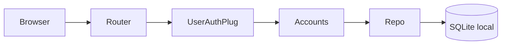

# Step 1 - Foundation & Auth

## 1) O que foi implementado
- Estrutura base de aplicação Phoenix chamada `WCore`.
- Configuração de SQLite com Ecto (`WCore.Repo`) e ambientes `dev/test/prod`.
- Contexto `Accounts` com autenticação estilo `phx.gen.auth`:
  - `users` + `users_tokens`
  - registro de usuário
  - login com sessão via token persistido
  - plug `WCoreWeb.UserAuth` para proteção de rotas
- Rotas de autenticação:
  - `GET/POST /users/register`
  - `GET/POST /users/log_in`
  - `DELETE /users/log_out`
- Home redireciona para login ou dashboard de acordo com sessão.

## 2) Mudanças de arquitetura

- O domínio de autenticação foi isolado no contexto `Accounts` (sem dependência da camada de Telemetria).
- A camada web (`controllers/plugs`) apenas orquestra login/registro e aplica controle de acesso.

## 3) Trade-offs e decisões
- **Sessão por token no banco**: adiciona leitura extra no login/request, mas permite invalidação explícita de sessão.
- **SQLite local com WAL**: favorece escrita concorrente local para edge computing.
- **Domínio separado do web**: aumenta número de módulos, mas melhora testabilidade e reduz acoplamento.

