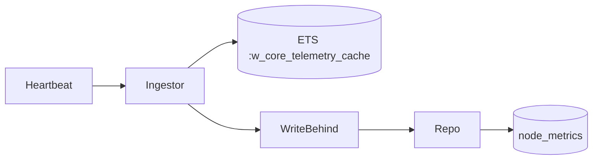

# Step 2 - OTP & ETS

## 1) O que foi implementado
- Contexto `Telemetry` com modelagem:
  - `nodes` (cadastro de sensores)
  - `node_metrics` (estado consolidado persistido)
- Tabela ETS nomeada `:w_core_telemetry_cache` via `WCore.Telemetry.Cache`.
- Pipeline OTP de ingestão:
  - `WCore.Telemetry.Ingestor` (recebe eventos e atualiza ETS)
  - `WCore.Telemetry.WriteBehind` (flush em lote para SQLite)
  - `WCore.Telemetry.Supervisor` com estratégia `:rest_for_one`
- API de ingestão: `Telemetry.ingest_heartbeat/1`.

## 2) Mudanças de arquitetura

- Escrita crítica saiu do caminho síncrono de banco e entrou no cache em memória.
- Persistência virou assíncrona (write-behind), com flush temporal e por tamanho de lote.

## 3) Trade-offs e decisões
- **ETS `:set` + named table**:
  - lookup O(1) por `node_id`
  - simples para manter apenas o estado mais recente por nó.
- **`ets:update_counter` para contagem de eventos**:
  - contagem atômica e barata
  - evita lock explícito em estrutura própria.
- **Broadcast apenas em mudança de status**:
  - reduz pressão no PubSub
  - mantém alerta instantâneo em transições relevantes (`ok -> fault`, etc.).
- **Supervisor `:rest_for_one`**:
  - se cache reiniciar, reinicia write-behind/ingestor para consistência do pipeline.

