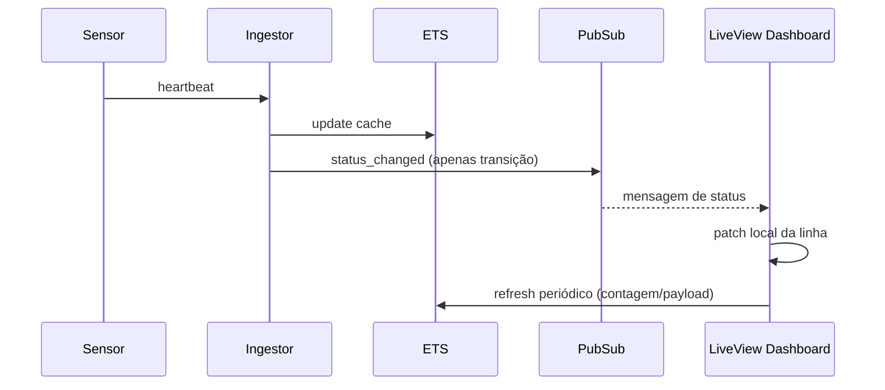

# Step 3 - LiveView & Design System

## 1) O que foi implementado
- Dashboard autenticado em LiveView (`/dashboard`).
- Componentes HEEx próprios:
  - KPIs de status (`ok/warning/fault/unknown`)
  - badges de status
  - tabela operacional de nós/sensores
- Interface atualizada em tempo real com:
  - `Phoenix.PubSub` para mudança de status (evento imediato)
  - refresh leve periódico para contadores/payloads do ETS.

## 2) Mudanças de arquitetura

## 3) Trade-offs e decisões
- **Evitar gargalo no PubSub**:
  - não publicar cada pulso
  - publicar só transições de status.
- **Consistência visual**:
  - PubSub dá alerta instantâneo
  - polling curto do hot cache corrige contadores sem inundar canal.
- **HEEx puro + CSS próprio**:
  - sem libs pesadas de UI
  - manutenção simples para ambiente controlado de edge.

