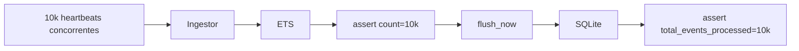

# Step 4 - Testes e Caos Controlado

## 1) O que foi implementado
- `cache_test.exs`: valida atualização de estado e incremento de contagem no ETS.
- `ingestion_pipeline_integration_test.exs`: teste de integração com 10.000 eventos concorrentes.

### Coberturas principais
- Nenhuma perda de eventos no ETS sob concorrência alta.
- Estado final consistente após evento crítico final (`fault`).
- Flush write-behind sincronizando corretamente em `node_metrics` no SQLite.

## 2) Mudanças de arquitetura

## 3) Trade-offs e decisões
- **Teste `async: false`**:
  - necessário por causa da tabela ETS global e worker compartilhado.
- **Evento final determinístico**:
  - após os 9.999 concorrentes, envia-se um heartbeat final `fault`
  - facilita asserção do estado terminal.
- **`wait_until` com retry curto**:
  - absorve assincronismo natural de `GenServer.cast` sem usar sleeps longos fixos.

