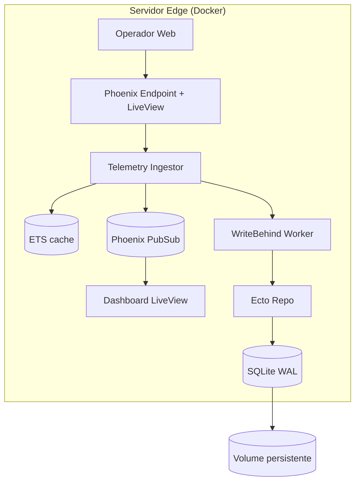

# Step 5 - Infra e Release Edge

## 1) O que foi implementado
- `Dockerfile` multi-stage com `mix release`.
- Build com:
  - compilacao de deps
  - build de assets (`mix assets.deploy`)
  - release final `w_core`
- Runtime enxuto em Debian slim.
- Persistencia do SQLite via volume:
  - `DATABASE_PATH=/var/lib/w_core/w_core_prod.db`
  - `VOLUME /var/lib/w_core`
- Boot da release roda migrations automaticamente antes de subir o endpoint (`WCore.Release.migrate`).

## 2) Diagrama arquitetural final

## 3) Trade-offs e decisões
- **Release Elixir pura**:
  - facilita deploy em edge sem toolchain completa.
- **SQLite local com volume**:
  - simplicidade operacional
  - preserva historico após restart do container.
- **Multi-stage build**:
  - imagem final menor
  - separacao clara entre build e runtime.
